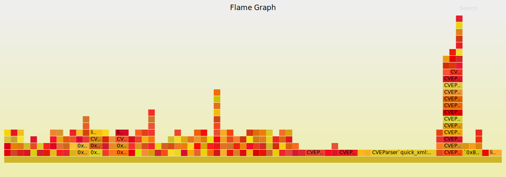

# FreeBSD CVE Checker

## Introduction

This is a CVE checker written in Rust. It uses FreeBSD's maintained vulnerability database (/var/db/pkg/vuln.xml) to look for vulnerabilities, then compare them against the list of installed packages (/var/db/pkg/local.sqlite)

## Progress report
### Week 1
- So far, the checker could fetch the list of vulnerabilities, the list of installed packages, and compare them.
- For the XML fetch, the code currently covers most cases, including vulnerabilities affecting multiple versions of a single package, and vulnerabilities affecting a single version of multiple flavors of a packages. Currently cve descriptions are printed as they are in the xml file.
- Installed packages are compared to the database to see if they are present, then their versions are compared to see if they are affected. Version checking of packages assumes that version naming scheme is consistent across a package.
### Week 2
- Several optimizations over the first version was implemented, these include: using StAX instead of DOM to parse xml, matching packages with binary search, and using shared references to reduce cloning.
- The checker can now also differentiate between <lt>/<le> and <gt>/<ge> xml tags, and can handle most version numbers - package names combinations. 
- Also, the xml parsing scope was expanded to the entire vuln.xml file instead of just a few years back, but there was still improvement in performance due to optimizations.

## Todo

- [X] Support the case of M packages to N version ranges.
- [X] Differentiate le/lt and ge/gt
- [ ] Store vulnerable package data in relational DB.

## Ongoing
- [ ] Conduct further testing
- [ ] Improve performance

## Current flamegraph

